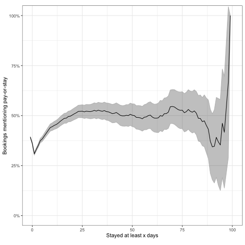

# Section 2: Data and Methods

These data represent:

* 4291977
individual jail bookings;
* 343684
bookings where one or more of the booking charges was failure to pay;
* 129173
bookings in which an individual was booked _only_ on charges involving failure
to pay;
* 2740744 cases from the state of Oklahoma;
* 195316 cases from
Oklahoma involving failure to pay.

Our Texas analysis consists of
64 counties. The combined population of
these counties is
14800000 people,
or approximately
53%
of Texas's population.

In Wisconsin, we have 28 counties, with
a combined population
3100000
people. These counties make up
53%
of Wisconsin's population.

# Section 3: Results

## Section 3.1: Scope and Consequences of Debt Imprisonment

### Section 3.1.1: _Per Capita_ Booking Rates


```r
d_tx_all_ftp <- d_tx %>%
  group_by(geo_county) %>%
  filter(any(all_ftp)) %>%
  ungroup() %>%
  filter(ymd(20050101) <= booking_date, booking_date <= ymd(20171231))

burglary_tx <- pop_tx %>%
  group_by(year) %>%
  summarize(pop = sum(pop), .groups = "drop") %>%
  left_join(burglary, by = "year") %>%
  mutate(burglary = 1e6 * burglary_tx / pop, year = make_date(year = year)) %>%
  select(year, burglary) %>%
  # NOTE: Texas did not report burglary data in 2015
  drop_na()

# Generate montly counts by county
d_tx_all_ftp_per_cap <- d_tx_all_ftp %>%
  group_by(geo_county, year = year(booking_date), month = month(booking_date),
           all_ftp, any_ftp, booking_id) %>%
  summarize(.groups = "drop") %>%
  group_by(geo_county, year, month) %>%
  summarize(
    total_bookings = n(),
    all_ftp_bookings = sum(all_ftp, na.rm = TRUE),
    .groups = "drop"
  ) %>%
  group_by(geo_county) %>%
  # Sometimes bookings include small numbers of individuals from other years,
  # even if the rest of the data from those years are not available. Typically,
  # this is because their sentences are very long. Filter those years.
  filter(total_bookings > 0.05 * max(total_bookings)) %>%
  # Add county population totals
  ungroup() %>%
  left_join(pop_tx, by = c("geo_county", "year")) %>%
  # Group by month and year to calculate per capita rate
  group_by(year, month) %>%
  summarize(
    total_pop_represented = sum(pop),
    per_capita_bookings = (365 / days_in_month(first(month))) * 1e6 * sum(total_bookings) / sum(pop),
    per_capita_ftp_bookings = (365 / days_in_month(first(month))) * 1e6 * sum(all_ftp_bookings) / sum(pop),
    .groups = "drop"
  ) %>%
  # Turn month and year into a date to order x-axis correctly
  mutate(date = make_date(year = year, month = month))

d_wi_all_ftp <- d_wi %>%
  group_by(geo_county) %>%
  filter(any(all_ftp)) %>%
  ungroup() %>%
  filter(ymd(20050101) <= booking_date, booking_date <= ymd(20171231))

burglary_wi <- pop_wi %>%
  group_by(year) %>%
  summarize(pop = sum(pop), .groups = "drop") %>%
  left_join(burglary, by = "year") %>%
  mutate(burglary = 1e6 * burglary_wi / pop, year = make_date(year = year)) %>%
  select(year, burglary)

# Generate montly counts by county
d_wi_all_ftp_per_cap <- d_wi_all_ftp %>%
  group_by(geo_county, year = year(booking_date), month = month(booking_date),
           all_ftp, any_ftp, booking_id) %>%
  summarize(.groups = "drop") %>%
  group_by(geo_county, year, month) %>%
  summarize(
    total_bookings = n(),
    all_ftp_bookings = sum(all_ftp, na.rm = TRUE),
    .groups = "drop"
  ) %>%
  group_by(geo_county) %>%
  # Sometimes bookings include small numbers of individuals from other years,
  # even if the rest of the data from those years are not available. Typically,
  # this is because their sentences are very long. Filter those years.
  filter(total_bookings > 0.05 * max(total_bookings)) %>%
  # Add county population totals
  ungroup() %>%
  left_join(pop_wi, by = c("geo_county", "year")) %>%
  # Group by month and year to calculate per capita rate
  group_by(year, month) %>%
  summarize(
    total_pop_represented = sum(pop),
    per_capita_bookings = (365 / days_in_month(first(month))) * 1e6 * sum(total_bookings) / sum(pop),
    per_capita_ftp_bookings = (365 / days_in_month(first(month))) * 1e6 * sum(all_ftp_bookings) / sum(pop),
    .groups = "drop"
  ) %>%
  # Turn month and year into a date to order x-axis correctly
  mutate(date = make_date(year = year, month = month))

combined_tot_pop <- bind_rows(
    pop_wi %>%
      group_by(year) %>%
      summarize(pop = sum(pop), .groups = "drop") %>%
      mutate(state = "Wisconsin"),
    pop_tx %>%
      group_by(year) %>%
      summarize(pop = sum(pop), .groups = "drop") %>%
      mutate(state = "Texas")
  )
  
combined_all_ftp_per_cap <- bind_rows(
    mutate(d_tx_all_ftp_per_cap, state = "Texas"),
    mutate(d_wi_all_ftp_per_cap, state = "Wisconsin")
  ) %>%
  left_join(combined_tot_pop, by = c("year", "state"))

burglary_combined <- bind_rows(
    mutate(burglary_tx, state = "Texas"),
    mutate(burglary_wi, state = "Wisconsin")
  )

ftp_plot <- combined_all_ftp_per_cap %>%
  ggplot(aes(x = date, y = per_capita_ftp_bookings)) +
  geom_line(
    aes(x = year, y = burglary, color = "Burglary"),
    data = burglary_combined,
    linetype = "dashed"
  ) +
  geom_smooth(
    aes(color = "Smoothed\naverage"),
    method = "loess",
    se = FALSE,
    formula = y ~ x
  ) +
  geom_line(aes(color = "FTP")) +
  scale_x_date(
    breaks = as_date(parse_date_time(2005:2018, "Y")),
    labels = NULL
  ) +
  expand_limits(y = 0) +
  labs(
    x = NULL,
    y = "Annual bookings\n(per million pop.)"
  ) +
  theme_bw() +
  scale_color_manual(
    name = "Booking\ntype",
    values = c(
      "Burglary" = "red",
      "Smoothed\naverage" = "blue",
      "FTP" = "black"
    )
  ) +
  facet_wrap(~state)

representation_plot <- combined_all_ftp_per_cap %>%
  ggplot(aes(x = date, y = total_pop_represented / pop)) +
  geom_area(alpha = 1/2, color = "black") +
  scale_x_date(
    breaks = as_date(parse_date_time(2005:2018, "Y")),
    labels = as.character(2005:2018)
  ) +
  scale_y_continuous(labels = label_percent(accuracy = 10)) +
  labs(
    y = "Pct. of state\npop. represented",
    x = NULL
  ) +
  coord_cartesian(ylim = c(0, 0.5)) +
  theme_bw() +
  theme(
    strip.text.x = element_blank(),
    axis.text.x = element_text(angle = 45, hjust = 1)
  ) +
  facet_wrap(~state)

g_1 <- ggplotGrob(ftp_plot)
# Add additional columns to second grobTable to account for missing legend
g_2 <- gtable_add_cols(ggplotGrob(representation_plot), g_1$widths[14:15])
final_plot <- rbind(g_1, g_2, size = "first")
final_plot$widths <- unit.pmax(g_1$widths, g_2$widths)
grid.draw(final_plot)
```


Out of the
64 counties providing data,
58
provided jail rosters that included enough information to rule out cases where
an individual was booked on a failure to pay charge as well as a more serious
charge. The combined population of these counties is 
8800000
people, or approximately
31.6%
of Texas's population.

In Wisconsin,
20
counties provided full jail rosters. The combined population of these counties is 
1100000
people, or
18.2%
of Wisconsin's population.

Extrapolating from these counties to the whole of Texas carries substantial
uncertainty. These counties represent a convenience sample, rather than a random
sample of Texas counties. Nevertheless, assuming they are _roughly_
representative, we would expect around
38000
people per year to have been arrested for failure to pay alone in the state.

Similarly, if we extrapolate to the whole state of Wisconsin, we would expect
8000
bookings for failure to pay alone per year in the whole state.

While courts we spoke to indicated that an individual who came in to work on a
payment plan would have their warrants recalled (cf. Tex. Crim. C. Sec.
425.045), it is possible that individuals who voluntarily reported directly to
jail, rather than the municipal court, to work on a financial plan might, in the
jail records, be “booked” without ever actually spending time in jail. To
upper-bound the size of this subpopulation, we look, where data are available,
at very short stays, and, in particular, at the percentage of stays that last
less than an hour.


```r
has_time <- d %>%
  distinct(booking_id, length_of_stay, geo_state, geo_county) %>%
  group_by(geo_state, geo_county) %>% 
  summarize(
    p = mean(length_of_stay != round(length_of_stay), na.rm = TRUE),
    .groups = "drop"
  ) %>%
  arrange(desc(p)) %>% 
  filter(p > 0.5)

short_stays <- d %>%
  filter(all_ftp) %>%
  distinct(booking_id, length_of_stay, geo_state, geo_county) %>%
  semi_join(has_time, by = c("geo_state", "geo_county")) %>%
  with(ecdf(length_of_stay)) %>%
  map_dbl(1:24 / 24, .) %>%
  tibble(hours = 1:24, pct = .)
```

We find that
8%
of stays last an hour or less.

We turn to estimating the percentage of court debtors who are ultimately jailed
for unpaid court debt.


```r
cpf_per_person <- d_tx %>%
  filter(any_ftp) %>%
  mutate(
    n_cpf = str_count(
      str_c_na(charge, statute, warrant_type, note, severity, release_type,
            sep = " "),
      "(?i)CPR?F|CAP(IAS)? ?PRO ?(FINE)?"
    )
  ) %>%
  with(sum(n_cpf, na.rm = TRUE) / n_distinct(booking_id))
```

On this basis, we estimate that
8%
of individuals with an outstanding CPF warrant for unpaid court debts are jailed
in a given year on that basis alone.

### Section 3.1.2: Length of Stay


```r
d_tx_all_ftp_los <- d_tx_all_ftp %>%
  group_by(geo_county) %>%
  summarize(
    pct_usable = mean(! is.na(length_of_stay)),
    pct_hms = mean(! is.na(booking_time)),
    .groups = "drop"
  ) %>%
  arrange(desc(pct_usable))

d_tx_all_ftp_los_red <- d_tx_all_ftp %>%
  semi_join(d_tx_all_ftp_los, by = "geo_county") %>%
  filter(! is.na(length_of_stay), all_ftp) %>%
  group_by(geo_county, booking_id, length_of_stay) %>%
  summarize(.groups = "drop") %>%
  ungroup() %>%
  filter(length_of_stay <= 100)

d_tx_all_ftp_los_red_quants <- d_tx_all_ftp_los_red %>%
  with(tibble(
    state = "Texas",
    pct = c(0.5, 0.95, 0.99),
    label = c("", "(95%)", "(99%)"),
    length_of_stay = quantile(length_of_stay, pct)
  ))

d_wi_all_ftp_los <- d_wi_all_ftp %>%
  group_by(geo_county) %>%
  summarize(
    pct_usable = mean(! is.na(length_of_stay)),
    pct_hms = mean(! is.na(booking_time)),
    .groups = "drop"
  ) %>%
  arrange(desc(pct_usable))

d_wi_all_ftp_los_red <- d_wi_all_ftp %>%
  semi_join(d_wi_all_ftp_los, by = "geo_county") %>%
  filter(! is.na(length_of_stay), all_ftp) %>%
  group_by(geo_county, booking_id, length_of_stay) %>%
  summarize(.groups = "drop") %>%
  ungroup() %>%
  filter(length_of_stay <= 100)

d_wi_all_ftp_los_red_quants <- d_wi_all_ftp_los_red %>%
  with(tibble(
    state = "Wisconsin",
    pct = c(0.5, 0.95, 0.99),
    label = c("(50%)", "(95%)", "(99%)"),
    length_of_stay = quantile(length_of_stay, pct)
  ))

d_wi_all_ftp_los_red %>%
  mutate(state = "Wisconsin") %>%
  bind_rows(mutate(d_tx_all_ftp_los_red, state = "Texas")) %>%
  ggplot(aes(x = length_of_stay)) +
  scale_y_log10(expand = expansion(mult = c(0, 1/8))) +
  geom_vline(
    aes(xintercept = length_of_stay),
    data = bind_rows(d_tx_all_ftp_los_red_quants, d_wi_all_ftp_los_red_quants),
    linetype = "dashed"
  ) +
  geom_text(
    aes(x = 10 + length_of_stay, y = 10^5.5, label = label),
    data = bind_rows(d_tx_all_ftp_los_red_quants, d_wi_all_ftp_los_red_quants)
  ) +
  geom_histogram(binwidth = 5, color = "black") +
  labs(
    x = "Length of stay (days)",
    y = "Number of bookings"
  ) +
  theme_bw() +
  facet_grid(cols = vars(state))
```


Not all counties provided both booking and release dates. Therefore, we limit
our analysis to the 57 counties for which we can
meaningfully calculate the length of an individual's jail stay. These counties
have a combined population of
5400000
people, or approximately
19.4%
of Texas's population.

A small number of individuals, around 
0.4%,
have stays longer than 100 days. It's likely that there are record-keeping errors
for these individuals, and so we drop them from the analysis.

In Wisconsin, for the same reason
we limit our analysis to 18 counties.
These counties have a combined population of
700000
people,
11.5%
of Wisconsin's population. Likewise, of the FTP bookings represented, we drop the
2.1%
in which the stays are longer than 100 days.

In Texas, the most frequent length of stay is
0
days, and the median length of stay is
1
day. Because the majority of individuals stay for a day or less, the mean length
of stay is a relatively noisey measure. Unfortunately, only
6 counties
provide the time of both booking and release. Among those six counties, the
mean length of stay is 
5.07
days, while the mean length of stay is
2.1 days
among all counties. This discrepancy appears to be due more to systematic policy
differences than to measurement error, as the the mean in counties with time 
information, _ignoring_ time information, is
5.05
days.

In Wisconsin, the most frequent length-of-stay is
0
days. The median length of stay is
1
day.
8 counties
provide the time of both booking and release. Among those them counties, the
mean length of stay is 
9.26
days. The mean length of stay is
6.2 days
among all counties.  (The the mean in counties with time information, _ignoring_
time information, is
9.29
days.)

Most stays are very short, representing individuals who were arrested on an
oustanding warrant and brought before a judge roughly within the next business
day. To understand what might be driving longer stays, we examine how the 
proportion of "pay-or-stay" cases changes as we restrict our attention to longer
and longer jail stays.


```r
PAY_OR_STAY_REGEX <- glue(
    "(LAY|L(AI)?D|PAY|P(AI)?D) ?(OUT)? (FINE|FEE)",
    "(FINE|FEE)S? (PAY|P(AI)?D)",
    "DAYS? TO PAY|D2P",
    "PAY ?OR ?STAY",
    "PAY.{{0,8}}OR.{{0,5}}DAYS?",
    .sep = "|"
  )

d_tx_all_ftp %>%
  filter(all_ftp, length_of_stay < 100) %>%
  mutate(
    pay_or_stay = str_detect(
      str_c_na(charge, statute, warrant_type, note, severity, release_type,
               sep = " "),
      PAY_OR_STAY_REGEX
    )
  ) %>%
  group_by(booking_id) %>%
  summarize(
    length_of_stay = round(mean(length_of_stay)),
    pay_or_stay = any(pay_or_stay),
    .groups = "drop"
  ) %>%
  group_by(length_of_stay) %>%
  summarize(
    pay_or_stay = sum(pay_or_stay, na.rm = TRUE),
    n = n(),
    n_na = sum(is.na(pay_or_stay)),
    .groups = "drop"
  ) %>%
  with(tibble(
    length_of_stay = c(-1, length_of_stay),
    pay_or_stay = sum(pay_or_stay) - c(0, cumsum(pay_or_stay)),
    n = sum(n) - c(0, cumsum(n)),
    n_na = sum(n_na) - c(0, cumsum(n_na)),
    pct = pay_or_stay / n,
    std.err = sqrt(pct * (1 - pct) / n)
  )) %>%
  ggplot(aes(x = length_of_stay)) +
  scale_y_continuous(labels = label_percent()) +
  geom_ribbon(
    aes(ymin = pct - 1.96 * std.err, ymax = pct + 1.96 * std.err),
    color = "grey",
    alpha = 0.3
  ) +
  geom_line(aes(y = pct)) +
  theme_bw() +
  labs(
    x = bquote("Stayed at least" ~ x ~ "days"),
    y = "Bookings mentioning pay-or-stay"
  ) +
  coord_fixed(ratio = 100, xlim = c(0,100), ylim = c(0,1))
```



## Section 3.2: Factors Contributing to Debt Imprisonment

### Section 3.2.1: Fine Amounts


```r
d_ok_case_type <- d_ok %>%
  mutate(
    case_type = fct_explicit_na(case_type),
    case_type = str_to_title(case_type),
    case_type = fct_infreq(case_type),
    case_type = fct_other(case_type, keep = c(
      "Traffic", "Criminal Misdemeanor", "Criminal Felony"
    ))
  )
```

```
## Warning: There was 1 warning in `mutate()`.
## ℹ In argument: `case_type = fct_explicit_na(case_type)`.
## Caused by warning:
## ! `fct_explicit_na()` was deprecated in forcats 1.0.0.
## ℹ Please use `fct_na_value_to_level()` instead.
```

```r
d_ok_case_type %>%
  filter(case_type == "Traffic", total_cost < 2000, ftp) %>%
  select(total_cost, ftp) %>%
  ggplot(aes(x = total_cost)) +
  geom_histogram(show.legend = FALSE, binwidth = 50, color = "black") +
  labs(
    title = NULL,
    x = "Total court costs (dollars)",
    y = "Number of cases"
  ) +
  theme_bw()
```


The average fine in traffic cases is
$221;
in FTP cases, it is
$483.
In misdemeanor cases, it is
$1011 and
$1599
when an FTP warrant is issued. In felony cases, it is
$2651
and
$3706
when an FTP warrant is issued.

The average length of time between filing a case and the first issue of an FTP
warrant is
1.6
years in all cases and
0.9
years in traffic cases.

### Section 3.2.2: Underlying Offenses


```r
d_all_ftp <- bind_rows(d_tx_all_ftp, d_wi_all_ftp) %>%
  filter(all_ftp)

d_all_ftp_aug <- d_all_ftp %>%
  drop_na(charge) %>%
  mutate(
    charge = str_to_lower(charge),
    traffic = str_detect(
      charge,
      glue(
        "license|nli|[^f]dl|ndl|nli|dwli|dwls|expired|revoked|suspended|valid|invalid|susp|exp",
        "speeding|mph|limit|speed",
        "responsibility|maintain|insurance|fmfr|ftmfr|mvi|fin resp|liability|liab ins",
        "motor|defective|display|seat|belt|plate|seatbelt|light|red",
        "signal|lane|yield|stop|turn|roadway|start|road|street",
        "driving|operate|operating|traffic|driver|vehicle|drive|toll|veh|roadway|passenger",
        .sep = "|"
      )
    ),
    intoxication = str_detect(
      charge,
      "public(?!.+(veh|motor))|intoxication|alcohol|furnish|furn alc|beer|wine|container(?!.+(veh|motor))|alco"
    ),
    # Open container in vehicle is traffic
    intoxication = intoxication & ! traffic,
    possession = str_detect(
      charge,
      glue(
        "poss(?!.+(alc|open))|posess(?!.+alc)",
        "marijuana|mj|oz|\\bcs\\b(?! def)|controlled|dru?g",
        .sep = "|"
      )
    ),
    theft = str_detect(
      charge,
      "theft|thft"
    ),
    doc = str_detect(
      charge,
      "doc|disorder"
    ),
    truancy = str_detect(
      charge,
      "attend|trua|traunt|truancy|(?<!trespass.{0,30}).+school(?! ?zone)"
    ),
    other = ! (traffic | intoxication | possession | theft | doc | truancy),
    category = extract_fct(
      traffic = traffic,
      intoxication = intoxication,
      possession = possession,
      theft = theft,
      `disorderly conduct` = doc,
      truancy = truancy,
      `other/unknown` = other,
      levels = c("traffic", "intoxication", "possession", "theft", "disorderly conduct", "truancy", "other/unknown")
    ),
    category = fct_explicit_na(category),
    category = fct_collapse(category, `other/unknown` = "(Missing)")
  ) %>%
  group_by(booking_id) %>%
  mutate(
    any_traffic = any(traffic),
    any_intoxication = any(intoxication),
    any_possession = any(possession),
    any_theft = any(theft),
    any_truancy = any(truancy)
  ) %>%
  ungroup()
```

Of all of the FTP cases in Oklahoma,
37%
are traffic cases.

This high percentage of traffic cases is mirrored by the charges represented in
FTP jailings in Texas and Wisconsin.
50%
of _all_ cases are identifiably traffic. Adjusting for the fact that 22\% of
cases lack the underlying charge information, assuming these cases are missing
at random, it would follow that
64%
are traffic related.

For the remaining categories we have that:

*
6%
(raw) and
7%
(adjusted) of charges are for public intoxication,
*
4%
(raw) and
5%
(adjusted) of charges are for posession of marijuana,
*
3%
(raw) and
4%
(adjusted) of charges are for theft,
*
1.3%
(raw) and
1.7%
(adjusted) of charges are for disorderly conduct,
*
1.3%
(raw) and
1.7%
(adjusted) of charges are truancy-related.

### Section 3.2.3: Racial Disparities


```r
d_tx_all_ftp_race <- d_tx_all_ftp %>% 
  group_by(geo_county, year = year(booking_date)) %>%
  summarize(
    pct_usable = mean(! is.na(race)),
    n = n(),
    .groups = "drop"
  ) %>%
  group_by(geo_county) %>%
  # Sometimes bookings include small numbers of individuals from other years,
  # even if the rest of the data from those years are not available. Typically,
  # this is because their sentences are very long. Filter those years.
  filter(n > 0.05 * max(n)) %>%
  ungroup() %>%
  select(-n) %>%
  arrange(desc(pct_usable))

d_tx_all_ftp_race_red <- d_tx_all_ftp %>%
  distinct(geo_county, booking_id, race, all_ftp, booking_date) %>%
  group_by(geo_county, year = year(booking_date)) %>%
  summarize(
    jail_pct_b = mean(race == "black", na.rm = TRUE),
    ftp_pct_b = sum(race == "black" & all_ftp, na.rm = TRUE) / sum(all_ftp, na.rm = TRUE),
    n_bookings = n(),
    n_ftp = sum(all_ftp, na.rm = TRUE),
    .groups = "drop"
  ) %>%
  mutate(
    ftp_pct_b = replace_na(ftp_pct_b, 0),
    jail_pct_b = replace_na(jail_pct_b, 0)
  ) %>%
  semi_join(
    filter(d_tx_all_ftp_race, pct_usable > 0.8),
    by = c("geo_county", "year")
  ) %>%
  left_join(pop_tx, by = c("geo_county", "year")) %>%
  ungroup()

d_tx_all_ftp_eth <- d_tx_all_ftp %>% 
  group_by(geo_county, year = year(booking_date)) %>%
  summarize(
    pct_usable = mean(! is.na(ethnicity)),
    n = n(),
    .groups = "drop"
  ) %>%
  group_by(geo_county) %>%
  # Sometimes bookings include small numbers of individuals from other years,
  # even if the rest of the data from those years are not available. Typically,
  # this is because their sentences are very long. Filter those years.
  filter(n > 0.05 * max(n)) %>%
  ungroup() %>%
  select(-n) %>%
  arrange(desc(pct_usable))

d_tx_all_ftp_eth_red <- d_tx_all_ftp %>%
  distinct(geo_county,  booking_id, ethnicity, all_ftp, booking_date) %>%
  group_by(geo_county, year = year(booking_date)) %>%
  summarize(
    jail_pct_h = mean(ethnicity == "hispanic", na.rm = TRUE),
    ftp_pct_h = sum(ethnicity == "hispanic" & all_ftp, na.rm = TRUE) / sum(all_ftp, na.rm = TRUE),
    n_bookings = n(),
    n_ftp = sum(all_ftp, na.rm = TRUE),
    .groups = "drop"
  ) %>%
  mutate(
    ftp_pct_h = replace_na(ftp_pct_h, 0),
    jail_pct_h = replace_na(jail_pct_h, 0)
  ) %>%
  semi_join(
    filter(d_tx_all_ftp_eth, pct_usable > 0.8),
    by = c("geo_county", "year")
  ) %>%
  left_join(pop_tx, by = c("geo_county", "year")) %>%
  ungroup()

d_wi_all_ftp_race <- d_wi_all_ftp %>% 
  group_by(geo_county, year = year(booking_date)) %>%
  summarize(
    pct_usable = mean(! is.na(race)),
    n = n(),
    .groups = "drop"
  ) %>%
  group_by(geo_county) %>%
  # Sometimes bookings include small numbers of individuals from other years,
  # even if the rest of the data from those years are not available. Typically,
  # this is because their sentences are very long. Filter those years.
  filter(n > 0.05 * max(n)) %>%
  ungroup() %>%
  select(-n) %>%
  arrange(desc(pct_usable))

d_wi_all_ftp_race_red <- d_wi_all_ftp %>%
  distinct(geo_county, booking_id, race, all_ftp, booking_date) %>%
  group_by(geo_county, year = year(booking_date)) %>%
  summarize(
    jail_pct_b = mean(race == "black", na.rm = TRUE),
    ftp_pct_b = sum(race == "black" & all_ftp, na.rm = TRUE) / sum(all_ftp, na.rm = TRUE),
    n_bookings = n(),
    n_ftp = sum(all_ftp, na.rm = TRUE),
    .groups = "drop"
  ) %>%
  mutate(
    ftp_pct_b = replace_na(ftp_pct_b, 0),
    jail_pct_b = replace_na(jail_pct_b, 0)
  ) %>%
  semi_join(
    filter(d_wi_all_ftp_race, pct_usable > 0.8),
    by = c("geo_county", "year")
  ) %>%
  left_join(pop_wi, by = c("geo_county", "year")) %>%
  ungroup()

d_wi_all_ftp_eth <- d_wi_all_ftp %>% 
  group_by(geo_county, year = year(booking_date)) %>%
  summarize(
    pct_usable = mean(! is.na(ethnicity)),
    n = n(),
    .groups = "drop"
  ) %>%
  group_by(geo_county) %>%
  # Sometimes bookings include small numbers of individuals from other years,
  # even if the rest of the data from those years are not available. Typically,
  # this is because their sentences are very long. Filter those years.
  filter(n > 0.05 * max(n)) %>%
  ungroup() %>%
  select(-n) %>%
  arrange(desc(pct_usable))

d_wi_all_ftp_eth_red <- d_wi_all_ftp %>%
  distinct(geo_county, booking_id, ethnicity, all_ftp, booking_date) %>%
  group_by(geo_county, year = year(booking_date)) %>%
  summarize(
    jail_pct_h = mean(ethnicity == "hispanic", na.rm = TRUE),
    ftp_pct_h = sum(ethnicity == "hispanic" & all_ftp, na.rm = TRUE) / sum(all_ftp, na.rm = TRUE),
    n_bookings = n(),
    n_ftp = sum(all_ftp, na.rm = TRUE),
    .groups = "drop"
  ) %>%
  mutate(
    ftp_pct_h = replace_na(ftp_pct_h, 0),
    jail_pct_h = replace_na(jail_pct_h, 0)
  ) %>%
  semi_join(
    filter(d_wi_all_ftp_eth, pct_usable > 0.8),
    by = c("geo_county", "year")
  ) %>%
  left_join(pop_wi, by = c("geo_county", "year")) %>%
  ungroup()
```

57 counties in Texas and
18 counties in Wisconsin
provided sufficient race information to carry out this analysis.
The Texas counties account for
8800000
residents in 2018, and the Wisconsin counties account for
900000
residents in 2018.

Among these counties in Texas,
24%
of individuals booked for any reason are Black,
29%
of individuals booked for FTP alone are Black, while
14%
of the population of these counties living below the poverty line are Black.
In Wisconsin,
9%
of individuals booked for any reason are Black,
14%
of individuals booked for FTP alone are Black, while
2%
of the population of these counties living below the poverty line are Black.

Among these counties in Texas,
42%
of individuals booked for any reason are Hispanic,
37%
of individuals booked for FTP alone are Hispanic, while
54%
of the population of these counties living below the poverty line are Hispanic.
In Wisconsin,
6%
of individuals booked for any reason are Hispanic,
4%
of individuals booked for FTP alone are Hispanic, while
6%
of the population of these counties living below the poverty line are Hispanic.


```r
d_origin <- bind_rows(d_tx_all_ftp, d_wi_all_ftp) %>%
  group_by(year = year(booking_date), geo_state, geo_county, zip, booking_id) %>%
  summarize(.groups = "drop") %>%
  group_by(year, geo_state, geo_county) %>%
  summarize(pct_usable = mean(! is.na(zip)), n = n(), .groups = "drop") %>%
  group_by(geo_state, geo_county) %>%
  # Sometimes bookings include small numbers of individuals from other years,
  # even if the rest of the data from those years are not available. Typically,
  # this is because their sentences are very long. Filter those years.
  filter(n > 0.05 * max(n)) %>%
  ungroup() %>%
  select(-n)

d_origin_red <- bind_rows(d_tx_all_ftp, d_wi_all_ftp) %>%
  filter(all_ftp) %>%
  group_by(geo_state, geo_county, year = year(booking_date), booking_id, zip) %>%
  summarize(.groups = "drop") %>%
  ungroup() %>%
  semi_join(filter(d_origin, pct_usable > 0.8), by = c("geo_state", "geo_county", "year")) %>%
  left_join(ZIPS_TO_FIPS, by = "zip")

# Convert the county names to FIPS codes
origin_fips <- fips_codes %>%
  mutate(
    county = str_to_lower(county),
    county = str_replace_all(county, "[^a-z]+", "_"),
    state = str_to_lower(state)
  ) %>%
  select(geo_state = state, geo_county = county, jail_county_code = county_code)

# Add the jail county codes to `d_origin_red`
d_origin_red %<>%
  left_join(origin_fips, by = c("geo_state", "geo_county")) %>%
  # Check if the booking could be out of county
  mutate(in_county = (geo_state == state_abbrev) & (county_code == jail_county_code)) %>%
  group_by(geo_state, geo_county, year, booking_id) %>%
  summarize(
    any_out_of_county = any(! in_county),
    all_out_of_county = all(! in_county),
    .groups = "drop"
  ) %>%
  ungroup()

# Summarize and plot
d_origin_red %>%
  group_by(geo_state, geo_county) %>%
  summarize(
    pct_all_out = mean(any_out_of_county, na.rm = TRUE),
    pct_all_in = mean(any_out_of_county, na.rm = TRUE),
    .groups = "drop"
  ) %>%
  ungroup() %>%
  mutate(
    geo_county = str_replace_all(geo_county, "_", " "),
    geo_county = str_to_title(geo_county),
    geo_state = str_to_upper(geo_state),
    nm = str_c(geo_county, ", ", geo_state),
    nm = fct_reorder(nm, pct_all_out, .desc = TRUE)
  ) %>%
  # NOTE: These two measures are viturally equal, so we ignore the difference.
  arrange(desc(pct_all_out)) %>%
  ggplot(aes(x = nm, y = pct_all_out)) +
  geom_col(color = "black") +
  scale_y_continuous(labels = label_percent()) +
  labs(
    y = "Proportion of FTP bookings of\nindividuals not living in county",
    x = ""
  ) +
  theme_bw() +
  theme(axis.text.x = element_text(angle = 45, hjust = 1))
```


In
39%
of cases where ZIP codes are available, the individual booked is from a ZIP code
in a different county.

# Appendix

## Robustness Checks

### Per capita rates


```r
d_tx_any_ftp <- d_tx %>%
  group_by(geo_county) %>%
  filter(any(any_ftp)) %>%
  ungroup() %>%
  filter(ymd(20050101) <= booking_date, booking_date <= ymd(20171231))

# Generate montly counts by county
d_tx_any_ftp_per_cap <- d_tx_any_ftp %>%
  group_by(geo_county, year = year(booking_date), month = month(booking_date),
           any_ftp, any_ftp, booking_id) %>%
  summarize(.groups = "drop") %>%
  group_by(geo_county, year, month) %>%
  summarize(
    total_bookings = n(),
    any_ftp_bookings = sum(any_ftp, na.rm = TRUE),
    .groups = "drop"
  ) %>%
  group_by(geo_county) %>%
  # Sometimes bookings include smany numbers of individuals from other years,
  # even if the rest of the data from those years are not available. Typicanyy,
  # this is because their sentences are very long. Filter those years.
  filter(total_bookings > 0.05 * max(total_bookings)) %>%
  # Add county population totals
  ungroup() %>%
  left_join(pop_tx, by = c("geo_county", "year")) %>%
  # Group by month and year to calculate per capita rate
  group_by(year, month) %>%
  summarize(
    total_pop_represented = sum(pop),
    per_capita_bookings = (365 / days_in_month(first(month))) * 1e6 * sum(total_bookings) / sum(pop),
    per_capita_ftp_bookings = (365 / days_in_month(first(month))) * 1e6 * sum(any_ftp_bookings) / sum(pop),
    .groups = "drop"
  ) %>%
  # Turn month and year into a date to order x-axis correctly
  mutate(date = make_date(year = year, month = month))

d_wi_any_ftp <- d_wi %>%
  group_by(geo_county) %>%
  filter(any(any_ftp)) %>%
  ungroup() %>%
  filter(ymd(20050101) <= booking_date, booking_date <= ymd(20171231))

# Generate montly counts by county
d_wi_any_ftp_per_cap <- d_wi_any_ftp %>%
  group_by(geo_county, year = year(booking_date), month = month(booking_date),
           any_ftp, any_ftp, booking_id) %>%
  summarize(.groups = "drop") %>%
  group_by(geo_county, year, month) %>%
  summarize(
    total_bookings = n(),
    any_ftp_bookings = sum(any_ftp, na.rm = TRUE),
    .groups = "drop"
  ) %>%
  group_by(geo_county) %>%
  # Sometimes bookings include smany numbers of individuals from other years,
  # even if the rest of the data from those years are not available. Typicanyy,
  # this is because their sentences are very long. Filter those years.
  filter(total_bookings > 0.05 * max(total_bookings)) %>%
  # Add county population totals
  ungroup() %>%
  left_join(pop_wi, by = c("geo_county", "year")) %>%
  # Group by month and year to calculate per capita rate
  group_by(year, month) %>%
  summarize(
    total_pop_represented = sum(pop),
    per_capita_bookings = (365 / days_in_month(first(month))) * 1e6 * sum(total_bookings) / sum(pop),
    per_capita_ftp_bookings = (365 / days_in_month(first(month))) * 1e6 * sum(any_ftp_bookings) / sum(pop),
    .groups = "drop"
  ) %>%
  # Turn month and year into a date to order x-axis correctly
  mutate(date = make_date(year = year, month = month))
  
combined_any_ftp_per_cap <- bind_rows(
    mutate(d_tx_any_ftp_per_cap, state = "Texas"),
    mutate(d_wi_any_ftp_per_cap, state = "Wisconsin")
  ) %>%
  left_join(combined_tot_pop, by = c("year", "state"))

burglary_combined <- bind_rows(
    mutate(burglary_tx, state = "Texas"),
    mutate(burglary_wi, state = "Wisconsin")
  )

alt_ftp_plot <- combined_any_ftp_per_cap %>%
  ggplot(aes(x = date, y = per_capita_ftp_bookings)) +
  geom_line(
    aes(x = year, y = burglary, color = "Burglary"),
    data = burglary_combined,
    linetype = "dashed"
  ) +
  geom_smooth(
    aes(color = "Smoothed\naverage"),
    method = "loess",
    se = FALSE,
    formula = y ~ x
  ) +
  geom_line(aes(color = "FTP")) +
  scale_x_date(
    breaks = as_date(parse_date_time(2005:2018, "Y")),
    labels = NULL
  ) +
  expand_limits(y = 0) +
  labs(
    x = NULL,
    y = "Annual bookings\n(per million pop.)"
  ) +
  theme_bw() +
  scale_color_manual(
    name = "Booking\ntype",
    values = c(
      "Burglary" = "red",
      "Smoothed\naverage" = "blue",
      "FTP" = "black"
    )
  ) +
  facet_wrap(~state)

alt_representation_plot <- combined_any_ftp_per_cap %>%
  ggplot(aes(x = date, y = total_pop_represented / pop)) +
  geom_area(alpha = 1/2, color = "black") +
  scale_x_date(
    breaks = as_date(parse_date_time(2005:2018, "Y")),
    labels = as.character(2005:2018)
  ) +
  scale_y_continuous(labels = label_percent(accuracy = 10)) +
  labs(
    y = "Pct. of state\npop. represented",
    x = NULL
  ) +
  coord_cartesian(ylim = c(0, 0.5)) +
  theme_bw() +
  theme(
    strip.text.x = element_blank(),
    axis.text.x = element_text(angle = 45, hjust = 1)
  ) +
  facet_wrap(~state)

g_1 <- ggplotGrob(alt_ftp_plot)
# Add additional columns to second grobTable to account for missing legend
g_2 <- gtable_add_cols(ggplotGrob(alt_representation_plot), g_1$widths[14:15])
final_plot <- rbind(g_1, g_2, size = "first")
final_plot$widths <- unit.pmax(g_1$widths, g_2$widths)
grid.draw(final_plot)
```


Out of the
64 counties providing data,
60
provided jail rosters included in the figure above. The combined population of
these counties is 
13500000
people, or approximately
48.4%
of Texas's population.

In Wisconsin,
25
counties provided full jail that allowed us to identify FTP. The combined
population of these counties is 
2600000
people, or
45.5%
of Wisconsin's population.

In counties where individuals booked on any and all FTP charges can be
distinguished, we see that there are
81
percent more bookings that include any FTP than include only FTP in Texas and
81
in Wisconsin.

### Disparities


```r
d_tx_all_ftp_race_red_zip <- d_tx_all_ftp %>%
  distinct(geo_county, booking_id, race, all_ftp, booking_date) %>%
  # Remove individuals from out of county
  semi_join(filter(d_origin_red, !any_out_of_county), by = "booking_id") %>%
  group_by(geo_county, year = year(booking_date)) %>%
  summarize(
    jail_pct_b = mean(race == "black", na.rm = TRUE),
    ftp_pct_b = sum(race == "black" & all_ftp, na.rm = TRUE) / sum(all_ftp, na.rm = TRUE),
    n_bookings = n(),
    n_ftp = sum(all_ftp, na.rm = TRUE),
    .groups = "drop"
  ) %>%
  mutate(
    ftp_pct_b = replace_na(ftp_pct_b, 0),
    jail_pct_b = replace_na(jail_pct_b, 0)
  ) %>%
  semi_join(
    filter(d_tx_all_ftp_race, pct_usable > 0.8),
    by = c("geo_county", "year")
  ) %>%
  left_join(pop_tx, by = c("geo_county", "year")) %>%
  ungroup()

d_tx_all_ftp_eth_red_zip <- d_tx_all_ftp %>%
  distinct(geo_county,  booking_id, ethnicity, all_ftp, booking_date) %>%
  # Remove individuals from out of county
  semi_join(filter(d_origin_red, !any_out_of_county), by = "booking_id") %>%
  group_by(geo_county, year = year(booking_date)) %>%
  summarize(
    jail_pct_h = mean(ethnicity == "hispanic", na.rm = TRUE),
    ftp_pct_h = sum(ethnicity == "hispanic" & all_ftp, na.rm = TRUE) / sum(all_ftp, na.rm = TRUE),
    n_bookings = n(),
    n_ftp = sum(all_ftp, na.rm = TRUE),
    .groups = "drop"
  ) %>%
  mutate(
    ftp_pct_h = replace_na(ftp_pct_h, 0),
    jail_pct_h = replace_na(jail_pct_h, 0)
  ) %>%
  semi_join(
    filter(d_tx_all_ftp_eth, pct_usable > 0.8),
    by = c("geo_county", "year")
  ) %>%
  left_join(pop_tx, by = c("geo_county", "year")) %>%
  ungroup()

d_wi_all_ftp_race_red_zip <- d_wi_all_ftp %>%
  distinct(geo_county, booking_id, race, all_ftp, booking_date) %>%
  # Remove individuals from out of county
  semi_join(filter(d_origin_red, !any_out_of_county), by = "booking_id") %>%
  group_by(geo_county, year = year(booking_date)) %>%
  summarize(
    jail_pct_b = mean(race == "black", na.rm = TRUE),
    ftp_pct_b = sum(race == "black" & all_ftp, na.rm = TRUE) / sum(all_ftp, na.rm = TRUE),
    n_bookings = n(),
    n_ftp = sum(all_ftp, na.rm = TRUE),
    .groups = "drop"
  ) %>%
  mutate(
    ftp_pct_b = replace_na(ftp_pct_b, 0),
    jail_pct_b = replace_na(jail_pct_b, 0)
  ) %>%
  semi_join(
    filter(d_wi_all_ftp_race, pct_usable > 0.8),
    by = c("geo_county", "year")
  ) %>%
  left_join(pop_wi, by = c("geo_county", "year")) %>%
  ungroup()

d_wi_all_ftp_eth_red_zip <- d_wi_all_ftp %>%
  distinct(geo_county, booking_id, ethnicity, all_ftp, booking_date) %>%
  # Remove individuals from out of county
  semi_join(filter(d_origin_red, !any_out_of_county), by = "booking_id") %>%
  group_by(geo_county, year = year(booking_date)) %>%
  summarize(
    jail_pct_h = mean(ethnicity == "hispanic", na.rm = TRUE),
    ftp_pct_h = sum(ethnicity == "hispanic" & all_ftp, na.rm = TRUE) / sum(all_ftp, na.rm = TRUE),
    n_bookings = n(),
    n_ftp = sum(all_ftp, na.rm = TRUE),
    .groups = "drop"
  ) %>%
  mutate(
    ftp_pct_h = replace_na(ftp_pct_h, 0),
    jail_pct_h = replace_na(jail_pct_h, 0)
  ) %>%
  semi_join(
    filter(d_wi_all_ftp_eth, pct_usable > 0.8),
    by = c("geo_county", "year")
  ) %>%
  left_join(pop_wi, by = c("geo_county", "year")) %>%
  ungroup()
```

After restricting to individuals from the county in question, among the counties
in Texas providing enough information to analyze racial and ethnic disparities,
23%
of individuals booked for any reason are Black,
22%
of individuals booked for FTP alone are Black, while
10%
of the population of these counties living below the poverty line are Black.
In Wisconsin,
15%
of individuals booked for any reason are Black,
15%
of individuals booked for FTP alone are Black, while
2%
of the population of these counties living below the poverty line are Black.

Among these counties in Texas,
61%
of individuals booked for any reason are Hispanic,
61%
of individuals booked for FTP alone are Hispanic, while
70%
of the population of these counties living below the poverty line are Hispanic.
In Wisconsin,
3%
of individuals booked for any reason are Hispanic,
3%
of individuals booked for FTP alone are Hispanic, while
4%
of the population of these counties living below the poverty line are Hispanic.

## Other Tables and Figures

### FTP Booking Rates


```r
combined_all_ftp_per_cap %>%
  ggplot(aes(x = date, y = per_capita_ftp_bookings / per_capita_bookings)) +
  geom_smooth(method = "loess", se = FALSE, formula = y ~ x) +
  geom_line() +
  scale_x_date(
    breaks = as_date(parse_date_time(2005:2018, "Y")),
    labels = as.character(2005:2018)
    # labels = rep_along(2005:2018, "")
  ) +
  scale_y_continuous(
    labels = label_percent()
  ) +
  expand_limits(y = 0) +
  labs(
    x = "Month of Booking",
    # x = NULL,
    y = "Bookings for failure to pay\n alone among all bookings"
  ) +
  theme_bw() +
  theme(axis.text.x = element_text(angle = 45, hjust = 1)) +
  facet_wrap(~state)
```


### Data availability


```r
d %>%
  select(
    state = geo_state,
    county = geo_county,
    race,
    ethnicity,
    sex,
    age,
    zip,
    booking_date,
    booking_time,
    release_date,
    release_time,
    charge,
    statute,
    severity,
    release_type,
    court,
    warrant_type,
    bond,
    fine,
    note,
    length_of_stay,
    ftp
  ) %>%
  group_by(state, county) %>%
  summarize_all(~ mean(! is.na(.)) > 0.8) %>%
  ungroup() %>%
  mutate(
    state = case_when(
      state == "tx" ~ "Texas",
      state == "wi" ~ "Wisconsin"
    ),
    county = str_replace_all(county, "_", " "),
    county = str_to_title(county)
  )
```

```
## # A tibble: 92 × 22
##    state county      race  ethnicity sex   age   zip   booking_date booking_time
##    <chr> <chr>       <lgl> <lgl>     <lgl> <lgl> <lgl> <lgl>        <lgl>       
##  1 Texas Anderson C… TRUE  TRUE      TRUE  FALSE TRUE  TRUE         FALSE       
##  2 Texas Angelina C… TRUE  TRUE      TRUE  TRUE  FALSE TRUE         TRUE        
##  3 Texas Austin Cou… TRUE  TRUE      TRUE  TRUE  FALSE TRUE         TRUE        
##  4 Texas Bell County TRUE  TRUE      TRUE  TRUE  FALSE TRUE         TRUE        
##  5 Texas Blanco Cou… TRUE  TRUE      TRUE  TRUE  TRUE  TRUE         FALSE       
##  6 Texas Bosque Cou… TRUE  TRUE      TRUE  TRUE  TRUE  TRUE         FALSE       
##  7 Texas Bowie Coun… TRUE  TRUE      TRUE  TRUE  FALSE TRUE         TRUE        
##  8 Texas Brazoria C… TRUE  TRUE      FALSE FALSE FALSE TRUE         TRUE        
##  9 Texas Brazos Cou… TRUE  TRUE      TRUE  TRUE  FALSE TRUE         TRUE        
## 10 Texas Chambers C… TRUE  TRUE      TRUE  FALSE FALSE TRUE         TRUE        
## # ℹ 82 more rows
## # ℹ 13 more variables: release_date <lgl>, release_time <lgl>, charge <lgl>,
## #   statute <lgl>, severity <lgl>, release_type <lgl>, court <lgl>,
## #   warrant_type <lgl>, bond <lgl>, fine <lgl>, note <lgl>,
## #   length_of_stay <lgl>, ftp <lgl>
```

### Urbanicity of Sample


```r
# Urbanicity
urbanicity <- read_csv(
    path("data", "urbanicity.csv"),
    show_col_types = FALSE
  ) %>%
  filter(geo_state %in% c("tx", "wi")) %>%
  mutate(
    sample = geo_county %in% c(
      d_tx_all_ftp$geo_county,
      d_wi_all_ftp$geo_county
    )
  )

urbanicity <- bind_rows(
    mutate(urbanicity, sample =  FALSE),
    filter(urbanicity, sample == TRUE)
  ) %>%
  mutate(population = if_else(sample, "Sample", "Overall")) %>%
  mutate(
    urbanicity_code = factor(
      urbanicity_code,
      levels = c("Large central metro", "Large fringe metro", "Medium metro",
                 "Small metro", "Micropolitan", "Non-core")
    ),
    state = if_else(geo_state == "tx", "Texas", "Wisconsin")
  ) %>%
  select(-sample, -geo_state)

urbanicity %>%
  count(state, population, urbanicity_code) %>%
  group_by(state, population) %>%
  mutate(p = n / sum(n)) %>%
  ungroup() %>%
  ggplot(aes(x = urbanicity_code, y = p)) +
  scale_y_continuous(labels = label_percent(10)) +
  geom_col(color = "black") +
  facet_grid(rows = vars(state), cols = vars(population)) +
  labs(x = "Urbanicity", y = "Proportion of counties") +
  theme_bw() +
  theme(axis.text.x = element_text(angle = 45, hjust = 1))
```


```r
urbanicity %>%
  group_by(state, population, urbanicity_code) %>%
  summarize(pop = sum(pop), .groups = "drop_last") %>%
  mutate(p = pop / sum(pop)) %>%
  ggplot(aes(x = urbanicity_code, y = p)) +
  scale_y_continuous(labels = label_percent(10)) +
  geom_col(color = "black") +
  facet_grid(rows = vars(state), cols = vars(population)) +
  labs(x = "Urbanicity", y = "Proportion of population") +
  theme_bw() +
  theme(axis.text.x = element_text(angle = 45, hjust = 1))
```


